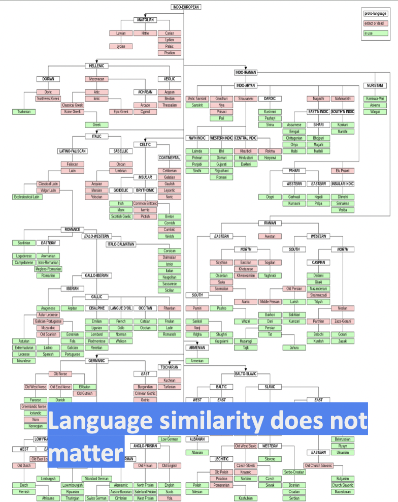
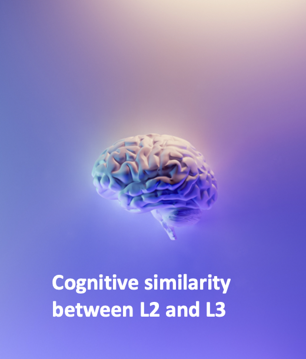
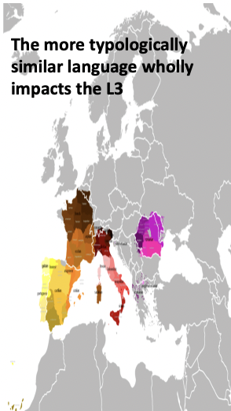

```{r, include = FALSE}
library(here)
library(tidyverse)
#source(here::here("scripts", "00_libs.R"))
#source(here::here("scripts", "new_sounds", "03_load_data.R"))
source(here::here("scripts", "perception", "03_load_data.R"))
```

```{r, setup, include=FALSE}
knitr::opts_chunk$set(
  comment = '', fig.width = 6, fig.height = 6, message = FALSE, warning = FALSE, echo = FALSE
)
```


class: title-slide-section, middle, center

# .black[L3 learning is **NOT** another case of L2 learning.]


.footnote[
There is not sole influence of the native language
]

---

class: title-slide-section, middle, center

## .black[There is a <br><br>**foreign language effect**<br><br>in L3 production.]


.footnote[ 
Meisel, 1983
]

---

# This foreign language effect has been found in:

--

.left[ 
### **Vowel production** <br><br>(Kamiyama, 2007)
]

--

.center[
### **Vowel reduction and speech rhythm** <br><br>(Gut, 2010)
]

--

.right[ 
### **Global accent production** <br><br>(Wrembel, 2010; Williams & Hammarberg, 1998)
]

.footnote[ 
]

---

# The L2 Status Factor Model

--


     
--


     
--
     

     
---

class: title-slide-section, middle, center

## .black[There is also evidence that <br><br>**overall language-similarity**<br><br> predicts language influence.]

.footnote[ 
Rothman, 2011
]

---

# The Typological Proximity Model

--


     
--


     
--
     

     
---

background-image: url(./img/review.png)
background-size: contain

---

class: title-slide-section, middle, center

## .black[Other findings (in VOT) point to <br><br>**simultaneous influence**<br><br> of both the L1 and L2 on the L3.]

.footnote[ 
Wrembel, (2011, 2014); Parrish (2022); Wunder (2010); Blank & Zimmer, (2009)
]
]

<!--- When we dig into segment-specific acoustics, we have a more nuanced view --->

---
class: title-slide-section, middle, center

# .black[L3 learning is **NOT** another case of L2 learning.]

---


class: title-slide-section, middle, center

#.black[...but we still don't know exactly how.]

.footnote[ 
and that's why I'm here!
]

---

class: title-slide-section, middle, center

#.black[...the roles of **typology**, **order of acquisition** and **linguistic structure** are at odds.]

.footnote[ 
]

---

class: title-slide-section, middle

# The present dissertation 

---

class: title-slide-section, middle, center
.black[
## How do <br><br>**Spanish-English bilinguals**<br><br> perceive and produce sounds of <br><br> **German and French**?]
.footnote[ 
]

---

class: title-slide-section, middle, center
.black[
## In French and German, I examined both <br><br>a **stop consonant** and **vowels**.]  
.footnote[ 
]

---

class: title-slide-section, middle, center
.black[
## I included **mirror-image groups** of bilinguals.<br><br>
]

--

.big[**L1 English**-.black[.bold[L2 Spanish]]]

--

.big[.black[.bold[L1 Spanish]]-**L2 English**]

.footnote[ 
]

---

# Overall Research Questions

.pull-left[
.full-width[
.content-box-grey[
.large[
.blue[RQ1]: Will **order of acquisition** impact language influence? 

.blue[RQ2]: Will **the language being learned** (French or German) bias the use of the more typologically similar source language?

.blue[RQ3]: Will **different segments** (stops and vowels) show similar levels of cross-linguistic influence?
]]]]


--

.pull-right[
.full-width[
.content-box-grey[
.large[
.blue[H1]: Yes, in production, but not necessarily in perception. 

.blue[H2]: Yes, German-English and French-Spanish biases will arise.

.blue[H3]: Maybe. Previous literature suggests that stops will be intermediate and vowels will be L2-like.
]]]]

---

class: title-slide-section, middle

# Participants 

---

# Participants 

.pull-left[
.full-width[
.content-box-red[
.large[
A total of **`r sum(count_df$n)`** participants completed at least one experiment.

**Groups:**

American English L1 - Spanish L2 group (n = `r count_df$n[1]`)

Mexican Spanish L1 - English L2 group (n = `r count_df$n[3]`)

English monolinguals (n = `r count_df$n[2]`)

Spanish monolinguals  (n = `r count_df$n[4]`) 
]]]]

--

.pull-right[
.full-width[
.content-box-blue[
.large[
**Profiles:**

Completed the **Bilingual Language Profile** (Birdsong et al., 2012).

Answered "no" to the questions "Do you speak any languages in addition to English and Spanish?".
]]]]

---

background-image: url(./img/ao_aoa_up.png)
background-size: contain

---

background-image: url(./img/prof_up.png)
background-size: contain

---

class: title-slide-section, middle

# Perception

---

# Perception

.pull-left[
.full-width[
.content-box-grey[
.big[
.blue[RQ1]: Are L3 sounds at first exposure categorized using both L1 and L2 categories? 

.blue[RQ2]: Will order of acquisition or the L3 (French or German) impact categorization? 

.blue[RQ3]: Do L3 learners show sensitivity to English-like vowel contrasts in L3 words?
]]]]

---

class: title-slide-section, middle

# Perceptual Assimilation Task 

.large[
American English L1 - Spanish L2 group (n = 63)

Mexican Spanish L1 - English L2 group (n = 68)

English monolinguals (n = 56)

Spanish monolinguals (n = 29) 
]

---

background-image: url(./img/vct.png)
background-size: contain

---

background-image: url(./img/likert.png)
background-size: contain

---

# Perceptual Assimilation Task 

.pull-left[
.full-width[
.content-box-grey[
.big[
Spanish bias **/o/** 

English bias **/ʌ/**

Both **/i/** 

Neither **/y/**
]]]]


---

# Words used to elicit stimuli 

.pull-left[
.full-width[
.content-box-grey[
.big[
Spanish bias **/o/**: pof, pof  

English bias **/ʌ/**: puff, paf

Both **/i/**: pief, pif

Neither **/y/**: püf, puf
]]]]

---

background-image: url(./img/feef.png)
background-size: contain

---

background-image: url(./img/stimuli.png)
background-size: contain

---

# Perceptual Assimilation Task Answer Choices

.pull-left[
.full-width[
.content-box-red[
.big[
**Spanish choices**

/i/ *fin*

/u/ *su*

/o/ *son*
]]]]

--

.pull-right[
.full-width[
.content-box-blue[
.big[
**English choices**

/i/ *feel*

/ʌ/ *fun*

/u/ *fool*

/ɒ/ *fought*
]]]]

---

# Statistical Analysis

.pull-left[
.full-width[
.content-box-grey[
.large[
Bayesian Multinomial logistic regressions

**Outcome:** Word choice (7 levels: 4 English words and 3 Spanish words)

**Fixed effect predictors:** Phoneme (4 levels), self-rated proficiency in perception

**Random effect structure:** Intercept for participant 

`word choice ~ phoneme + proficiency + (1 | participant)`
]]]]

---

class: title-slide-section, middle

# Results 

---

background-image: url(./img/i_stim.png)
background-size: contain

---
background-image: url(./img/desc_i.png)
background-size: contain

---

background-image: url(./img/i_full.png)
background-size: contain

---

background-image: url(./img/o_stim.png)
background-size: contain

---
background-image: url(./img/desc_o.png)
background-size: contain

---

background-image: url(./img/o_full.png)
background-size: contain

---

background-image: url(./img/schwa_stim.png)
background-size: contain

---

background-image: url(./img/desc_schwa.png)
background-size: contain

---

background-image: url(./img/schwa_full.png)
background-size: contain

---

background-image: url(./img/y_stim.png)
background-size: contain

---

background-image: url(./img/desc_y.png)
background-size: contain

---

background-image: url(./img/y_full.png)
background-size: contain

---

# Interim discussion 

.pull-left[
.full-width[
.content-box-grey[
.large[
.blue[RQ1]: Are L3 sounds at first exposure categorized using both L1 and L2 categories?

.blue[RQ2]: Will order of acquisition or the L3 (French or German) impact categorization?
]]]]

--

.pull-right[
.full-width[
.content-box-grey[
.large[
.blue[Result of RQ1]: Yes - although there was a preference for English categories overall. 

.blue[Result of RQ2]: Order of acquisition did not impact categorizations in most cases. The L3 did not bias selections either.
]]]]

---

class: title-slide-section, middle

# AX discrimination task

.large[
American English L1 - Spanish L2 group (n = 34)

Mexican Spanish L1 - English L2 group (n = 51)

English monolinguals (n = 49)
]

---

background-image: url(./img/ax_ins.png)
background-size: contain

---

# Stimuli 

.big[Eight total seven-step continua were created to examine **two English-like vowel contrasts** (/i/ to /ɪ/ and /æ/–/a/) in "French" and "German".]

---

# Carrier words 

.pull-left[
.full-width[
.content-box-red[
.big[
**French words**

/i/ to /ɪ/ *fisch*

/i/ to /ɪ/ *pisch*

/i/ to /ɪ/ *pike*

/æ/–/a/ *pake*
]]]]

--

.pull-right[
.full-width[
.content-box-blue[
.big[
**German words**

/æ/–/a/ *fat*

/i/ to /ɪ/ *fit*

/æ/–/a/ *pat*

/i/ to /ɪ/ *pit*
]]]]

---

# Procedure 

.pull-left[
.full-width[
.content-box-grey[
.large[
Participants completed two AX discrimination tasks, one in "French" and one in "German." 

Each task contained 149 total trials.

All continuum step combinations were possible and were randomly drawn on a per-trial basis.

German and French tasks were completed in the same session with a small break between them.
]]]]


---

# Statistical Analysis

.full-width[
.content-box-grey[
.large[
Bayesian multilevel regression

**Outcome:** d' (continuous +/- 4.65)

**Fixed effect predictors:** group (L1 English or L1 Spanish), language (French or German)

**Random effect structure:** Intercept for participant 

`d' ~ group*language + (1 | participant)`
]]]

---

background-image: url(./img/ax_german.png)
background-size: contain


---

background-image: url(./img/ax_french.png)
background-size: contain

---
background-image: url(./img/ax-post.png)
background-size: contain

---

# Interim discussion 

.pull-left[
.full-width[
.content-box-grey[
.large[
.blue[RQ3]: Do L3 learners show sensitivity to English-like vowel contrasts in L3 words?
]]]]

--

.pull-right[
.full-width[
.content-box-grey[
.large[
.blue[Result of RQ3]: L1 English speakers show a higher level of sensitivity to English-like contrasts in L3 words than L1 Spanish speakers.
]]]]


---

class: title-slide-section, middle

# Production

---

# Production

.pull-left[
.full-width[
.content-box-grey[
.large[
.blue[RQ1]: When Spanish-English bilinguals produce French and German words at first exposure, to what degree will they be influenced by their known languages? 

.blue[RQ2]: Will source language impact vary as a function of segment (vowel or stop)?
]]]]


--

.pull-right[
.full-width[
.content-box-grey[
.large[
.blue[H1]: L3 sounds will fall between L1 and L2 sounds.

.blue[H2]: Stops will be intermediate, vowels will be more L2-like.
]]]]

---
class: title-slide-section, middle

# Vowel production

.large[
American English L1 - Spanish L2 group (n = 20)

Mexican Spanish L1 - English L2 group (n = 66)

English monolinguals (n = 58)

Spanish monolinguals (n = 28)
]

---

# Pseudoword Reading Task

.pull-left[
.full-width[
.content-box-grey[
.large[
Done in Spanish and English. 

Same vowel sounds tested in Chapter 3 

24 tokens per language (4 vowels x 6 repetitions). 

Half of tokens were p- intial.
]]]]

--

.pull-right[
.full-width[
.content-box-grey[
.large[
The English vowels /a/, /i/, /o/, /ʌ/ were solicited via faff, fiff, foff, fuff

The Spanish vowels /a/, /i/, /o/, /u/ were solicited using faf, fif, fof, fuf
]]]]

---

background-image: url(./img/feef.png)
background-size: contain

---

# (Pseudo)word Repetition Task

.pull-left[
.full-width[
.content-box-grey[
.large[
Done to elicit French and German tokens.

The audio from the perceptual assimilation task was used.

Half of tokens were p- intial.

Words were repeated given audio and an orthographic prompt
]]]]

--

.pull-right[
.full-width[
.content-box-grey[
.large[
French vowels /ʌ/, /i/, /o/, /y/: faf, fif, fof, fuf

German vowels /ʌ/, /i/, /o/, /y/ : fuff, fief, foff, füff
]]]]

---

background-image: url(./img/fif.png)
background-size: contain

---

# Statistical Analysis

.full-width[
.content-box-grey[
.large[
Bayesian multilevel regressions

**Outcome:** f1 or f2 (continuous)

**Fixed effect predictors:** group (L1 English or L1 Spanish), language (French, German, English, Spanish)

**Random effect structure:** Intercept for participant and token, varying slope per phoneme by participant 

`f1 or f2 ~ group*language + (phoneme*language | participant) + (1 | token)`
]]]

---

background-image: url(./img/i_stim.png)
background-size: contain

---

background-image: url(./img/04_i_prod.png)
background-size: contain

---
background-image: url(./img/i_plots.png)
background-size: contain

---

background-image: url(./img/o_stim.png)
background-size: contain

---

background-image: url(./img/04_o_prod.png)
background-size: contain

---

background-image: url(./img/o_plots.png)
background-size: contain

---

background-image: url(./img/schwa_stim.png)
background-size: contain

---

background-image: url(./img/04_schwa_prod.png)
background-size: contain

---
background-image: url(./img/schwa_plots.png)
background-size: contain

---

background-image: url(./img/y_stim.png)
background-size: contain
---

background-image: url(./img/04_u_prod.png)
background-size: contain

---

background-image: url(./img/u_plots.png)
background-size: contain

---

# Interim discussion 

.pull-left[
.full-width[
.content-box-grey[
.large[
.blue[RQ1]: When Spanish-English bilinguals produce French and German words at first exposure, to what degree will they be influenced by their known languages? 
]]]]

--

.pull-right[
.full-width[
.content-box-grey[
.large[
.blue[Result of RQ1]: Vowels were effectively imitated, with no clear evidence of cross-linguistic influence.   
]]]]


---
class: title-slide-section, middle

# VOT production

.large[
American English L1 - Spanish L2 group (n = 3)

Mexican Spanish L1 - English L2 group (n = 25)
]

---
# Statistical Analysis

.full-width[
.content-box-grey[
.large[
Bayesian multilevel regressions

Individual regressions were run for the 3 L1 English speakers, and a group model for the L1 Spanish speakers.

**Outcome:** VOT (continuous)

**Fixed effect predictors:** language (4 levels: Spanish, English, French and German).

**Random effect structure:**  Random intercepts for token and participant. Varying slopes by participant.

`vot ~ language + (language | participant) + (1 | token)`
]]]

---

class: title-slide-section, middle

# English speaker models 

---

background-image: url(./img/e_492828.png)
background-size: contain

---

background-image: url(./img/e_493072.png)
background-size: contain

---

background-image: url(./img/e_500265.png)
background-size: contain

---

class: title-slide-section, middle

# Spanish speakers model

---

background-image: url(./img/vot_mod.png)
background-size: contain

---

# Interim discussion 

.pull-left[
.full-width[
.content-box-grey[
.large[
.blue[RQ1]: When Spanish-English bilinguals produce French and German words at first exposure, to what degree will they be influenced by their known languages? 

.blue[RQ2]: Will source language impact vary as a function of segment (vowel or stop)?
]]]]

--

.pull-right[
.full-width[
.content-box-grey[
.large[
.blue[Results]: Stops, unlike vowels, show evidence of cross-linguistic influence, since **VOT fell between** Spanish and English values.
]]]]


---

class: title-slide-section, middle

# Perception-production link

.large[
American English L1 - Spanish L2 group (n = 9)

Mexican Spanish L1 - English L2 group (n = 28)
]


---

# Research questions

.pull-left[
.full-width[
.content-box-grey[
.large[
.blue[RQ1]: Do Spanish-English speakers show meaningful differences in perception in production at their initial exposure to a new language?
]]]]  

---
class: title-slide-section, middle

.big[
**Issue:** Continuous production data needed to be compared to categorical perception data
]

---

class: title-slide-section, middle

.big[
**Solution:** I devised a method to probabalistically convert the vowel data into forced choice data.  
]

---

background-image: url(./img/centroid.png)
background-size: contain

---

background-image: url(./img/distance_formula.png)
background-size: contain

---

# Statistical Analysis

.full-width[
.content-box-grey[
.large[
Bayesian logistic regression models per group

**Outcome:** Choosing a Spanish category (coded as 1)

**Fixed effect predictors:** mode (perception or production) and phoneme (4 levels: “i”, “u”, “a” or “o”.)

**Random effect structure:**  Random intercepts for token and participant. Varying slopes by participant.

`choice ~ mode + phoneme + (1 | participant)`
]]]


---

class: title-slide-section, middle

# L1 English speakers

---

background-image: url(./img/both_eng_desc.png)
background-size: contain

---

background-image: url(./img/both_eng_mod.png)
background-size: contain

---


class: title-slide-section, middle

# L1 Spanish speakers

---
background-image: url(./img/both_span_desc.png)
background-size: contain

---

background-image: url(./img/both_span_mod.png)
background-size: contain

---

# Discussion

.pull-left[
.full-width[
.content-box-grey[
.large[
.blue[RQ1]: Do Spanish-English speakers show meaningful differences in perception in production at their initial exposure to a new language?
]]]]  

--

.pull-right[
.full-width[
.content-box-grey[
.large[
.blue[Result]: While production was close to chance, perception was **more influenced by English** in both groups
]]]]  

---

# Overall Research Questions

.pull-left[
.full-width[
.content-box-grey[
.large[
.blue[RQ1]: Will **order of acquisition** impact language influence? 

.blue[RQ2]: Will **the language being learned** (French or German) bias the use of the more typologically similar source language?

.blue[RQ3]: Will **different segments** (stops and vowels) show similar levels of cross-linguistic influence?
]]]]

--

.pull-right[
.full-width[
.content-box-grey[
.large[
.blue[Result 1]: Order of acquisition was not an important predictor of language influence

.blue[Result 2]: There was not much evidence of overall bias based on the languages themselves. Segment specific acoustics appear to play a greater role.

.blue[Result 3]: Not all segments were impacted equally.
]]]]

---

# Implications for L3 models

.pull-left[
.full-width[
.content-box-grey[
.large[
- L3 learners are influenced by both of their known languages.  
  - In perception: Categorize vowels using both Spanish and English  
  - In production: VOT fell between L1 and L2 values 

- Perception and production are impacted differently
 - Perception was more influenced by English in both groups than production. 
]]]] 

--

.pull-right[
.full-width[
.content-box-grey[
.large[ 
- Full transfer models cannot account for these findings. 

- There is a need for a phonetics-phonology specific L3 model.
]]]]
 

